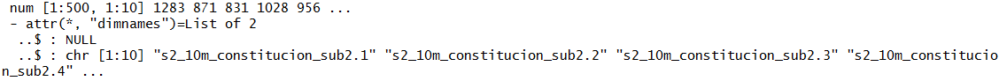

## One-class classification of a Sentinel-2 image with R ##

### Overview ###

In this lecture you will learn how to perform a one-class classification using a Sentinel-1 and a Sentinel-2 image in R.  We will conduct two classifications, once focusing on pixel level (using Sentinel-2 data) and one focusing on object-level (using Sentinel-1 data). The learned processing steps include:

- Loading the Sentinel-data and the training data
- Calibrating the one-class-classification algorithm in a pixel-based and a object-based approach
- identifying a suitable threshold
- mapping the class of interest

The datasets applied in this tutorial are available here:

[https://drive.google.com/open?id=11CR5p08W-zJKB4q2znNhl_mg1HYWMWSq](https://drive.google.com/open?id=11CR5p08W-zJKB4q2znNhl_mg1HYWMWSq)

## Pixel-based one-class-classification ##

### Datasets used in this Tutorial ###

In this tutorial we will use a Sentinel-2 image and two shapefiles created in QGIS. One contains some points representing the target class (grasslands) and another one containing the background class (see below for details)

### Step 1: Loading packages and Sentinel-2 data  ###

As first step, load all necessary R packages by executing the following code:

	require("devtools")
	require("pROC")
	require("caret")
	require("raster")
	require("rgdal")
	require("glcm")
	require("e1071")
	
In this tutorial we will use a R-package that is not on the official R-CRAN page. We will install this package directly from the code-sharing platform github. This requires the successful installation and loading of the devtools-package which provides the **install_github()** function. We run:

	install_github("benmack/oneClass")
	require("oneClass")

In some cases this installation may fail and an error message will tell you that some other related package is missing. If this is the case, try to first install the package named in the error messages and then re-run the code to install the oneClass package.

Be aware that you will have to run the install_github() command only one time. Once the package is installed successfully, you can use comment-symbol (#) to deactivate the line in your code.

Next, we will load the Sentinel-2 image using the steps you already know from the two proceeding Tutorials. We will use the same Sentinel-2 scene that you already applied in the last Tutorial:

	setwd("D:/Remote_Sensing/1_Fernerkundung/One_class_classification")
	img <- stack("s2_10m_constitucion_sub2.tif")

Just for the fun of it, we can have a quick look at a  RGB plot:

	plotRGB(img, r=3,g=2,b=1, stretch="hist")

### Step 2: Loading training data and extract pixel values  ###

Next we will load and plot the training data for the target class and the background data. As you have learned in the lecture today, a one-class-classifier is a special form of a supervised classification where clearly defined training data is only required for the class of interest (**positive** **class**). There are then three versions of one-class-classifiers with respect to additional training data. The first version requires no additional training data. The second version of classifiers requires additional training data of the **negative** **class** (that is, all land-cover classes that are not the target class without further detailed specifications). The third version, which we will also investigate in this study, requires so called "**background** training data".

In the remote-sensing context, background data can be described as a random sample of pixels collected from the complete image extent. Hence, the collection of background data is very straightforward. Be aware that the background class is different from the negative class, as typically, the background data contains both, samples from the positive and negative class.

In this first part of the tutorial, our objective is to identify and map all grassland/pasture areas within the Sentinel-2 image.

We will now load the samples for the positive class (grassland) and the background (random sample of pixels collected over the whole extent of the image) for our classification example:

	# load training data of target class
	target_tr <- readOGR(".", "grassl") 
	# load background data
	backgr <- readOGR(".", "backgr")

We can now have a look at the locations of the sample pixels for the grasslands by running:

	plot(target_tr, add=T)

Be aware, that this plot will only work if you have also run the plotRGB command above. In case you did not, run the command now.

This will result in the following plot:

We can of course also visualize the locations of the background pixels by running:

	plot(backgr, add=T, col="red")

Which will result in this plot:

Now, we will extract the pixel values at the locations of the training data for the target class and the background samples:

	tr_data <- extract(img, target_tr, fun=mean)
	all_data <- extract(img, backgr, fun=mean)

You are already familiar with this command from the supervised classification tutorial.

We can have a quick look at the extracted values by running:

	str(tr_data)
	str(all_data)

Which will give us the following two console outputs:

We can see that the training data matrix for the positive class consists of 24 samples for which the corresponding pixel values for the 10 Sentinel-2 bands were extracted. On the other hand, we have a matrix with 500 background points with the same corresponding pixel values for the 10 bands.

### Step 3: Prparing the data and training the one-class classifier  ###

To prepare the classification we will now first add another column to the matrices of the positive and the background class. This column will contain the information concerning the class. As the class is defined as character, we need one additional step, that is the conversion of the matrix to a dataframe. We run the code:

	# convert extracted values to dataframe and add class names
	# target class
	tr_data2 <- as.data.frame(tr_data)
	tr_data2$class <- 'grass'
	# background
	all_data2 <- as.data.frame(all_data)
	all_data2$class <- 'backgr'

Next, we combine the two dataframes to one dataset by running:

	new <- rbind(tr_data2, all_data2)

Then, in the next step, we create two subsets from the just created **new** variable by separating the training data (columns 1-10) from the reference data, we just created (columnd 11).

We run:

	# extract bands for training (leave out classes)
	trdata <- new[,1:10]
	# define target class based on the classes 
	tr.new <- puFactor(new[, 11], positive='grass')

The **puFactor**-function translates the two classes into a ordered factor variables with two levels **un** (unlabeled/background) and **pos** (positive class) where **pos** is greater than **un**. This is a somewhat arbitrary step, which however, is required due to the way the one-class classifier was programmed.

We are now ready to train the one-class classification using the **trainOcc**-function:

	ocsvm.fit <- trainOcc(x=trdata, y=tr.new, method="ocsvm")

As you can see, we have to define the training data (x) and the reference information concerning the classes (y). As methods we use the one-class support vector machines. However, more one-class classification algorithms are available through the oneClass package and the method can be replaced (to see all available algorithms run **?trainOcc** in the console).

After running the code, you will see that, similarly as in the Tutorial for the supervised classification, a grid-search will be initiated and differing **sigma** and **nu** values will be examined, until an optimal set of those two values is determined by the parameter tuning.

### Step 4: Apply the classifier to the full image  ###

The trained one-class-classifier model is stored in the variable **ocsvm.fit**. We can now apply this classifier to the complete satellite image by running:

	ocsvm.pred <- predict(ocsvm.fit, img)

This process might take a while, depending on the applied image and your computer's performance. After the  prediction is accomplished we can have a look at the classification result by running:

	plot(ocsvm.pred)

As you can see in the plot, the output of the one-class classifier is not a categorical classification map, but rather a continuous output. The displayed values represent the distance from the separating hyperplane of the SVM algorithm. To discriminate our target class (grassland areas) from all remaining classes we will now have to define a threshold. 

However, finding the best or at least a suitable threshold is not always straightforward. The standard threshold is normally 0. If we have a look at the the continuous output of the one-class classifier, we can see that a threshold of 0 would mean that most green-colored areas would be classified as grasslands. If we compare this to the original satellite image, this result seems to be quite plausible.

However, the oneClass package offers an additional tool for visually checking whether there might be a more suitable threshold than 0. This diagnostic plot can be called by running:

	#open new window
	x11()
	# plot diagnostic plot
	hist(ocsvm.fit)

This will lead to the following graph:

In this graph, the svm distance values of the positive class are displayed in the two blue boxplots (light blue = training data, dark blue = validation data of the iterative training procedure/parameter tuning) while the svm distance values for the background class are summarized with the grey boxplot. Be aware, that a certain number of pixels of the background class normally belongs to the target class. Hence a certain overlap should be expected.

In the given example, the value ranges of the two classes are quite well separated. If we focus on the x-axis, it becomes clear that an ideal threshold for separating the two classes might not be located at 0 but rather at approximately -0.015.

So let's apply this threshold by running:
 
	### set threshold on image
	ocsvm.bin <- ocsvm.pred > -0.015

And then save this result to a separate raster-file:

	## write our classification image
	writeRaster(ocsvm.bin, filename="grassl_occ.tif", format="GTiff")
	
In the resulting raster-file all grassland areas should have a value of 1 and all other classes a value of 0. You can load the final classification map to QGIS and overlap the original satellite image with it to check the plausibility of the result.

We can furthermore, calculate a confusion matrix based on our original reference data by running:

	pos <- extract(ocsvm.bin, target_tr, fun=mean)
	neg <- extract(ocsvm.bin, backgr, fun=mean)
	
	pos_ref <- rep(1, length(pos))
	neg_ref <- rep(0, length(neg))
	
	confusionMatrix(c(pos, neg), c(pos_ref, neg_ref))

which will result in the following output:

**Exercise:** Try to understand this last piece of code and figure out why this step can be considered problematic. Do we really have a reliable evaluation of the result by running this code?

## Object-based one-class-classification ##

### Datasets used in this Tutorial ###

In this tutorial we will use a dataset of the Sentinel-1 satellite, which has a C-band radar sensor on board. This dataset will look notably different to the satellite images we have used so far. You will hear a bit more about Radar-sensors in one of the upcoming lectures. Fow now, we try to remember that radar data are created using antenna systems and that the final image that we will be using in this Tutorial has already undergone quite a number of processing steps to reach  to its current version.

We will furthermore use again two shapefiles, one containing the objects (resulting from a segmentation procedure in the Orfeo-Toolbox which will be presented in class) and a second one, containing a subset of these objects, representing the target class (forests).

### Step 1: Loading all packages and data  ###

The following part of the tutorial will essentially repeat the processing steps of the pixel-based approach with one important difference: The classification will be applied on an object-level instead of on the pixel level.

To start, we load all packages using:

	require("devtools")
	require("raster")
	require("rgdal")
	require("glcm")
	require("e1071")
	require("oneClass")

To better understand the concept of objects, we now first load the Sentinel-1 image, then the shapefiles containing the objects and then plot the objects on top of the image:

	# jump into directory
	setwd("D:/Remote_Sensing/1_Fernerkundung/One_class_classification/object_based")
	#load image
	img <- stack("scaled_S1.tif")
	# plot the two bands of the image
	plotRGB(img, r=1, g=1, b=2, stretch="hist")

This will result in the following plot:

Be aware, that in the given case, we used one band two-times for the plotRGB-command. We did this, because the loaded Sentinel-1 image has only two bands (backscatter values in two differing polarizations) available.  

Next, we load and plot the objects/segments:

	# load segments (positive samples + all samples)
	# jump into directory

	# load segments (whole image)
	segm <- readOGR(".", "small")
	# load training segments of target class
	segm_tr <- readOGR(".", "small_tr")
	# plot the shapefile containing all segments
	plot(segm, add=T) 
 
This will result in the following plot:

As you can see, the segments are polygons that surround more or less homogeneous areas within the image. This approach has been developed in the remote sensing community (amongst other reasons) to reduce pixel-level noise and create more homogeneous classification results. So far, we only plotted all segments. Now let's have a look at the training data segments:

	plot(segm_tr, add=T, col="red")

As we can now see, the training data is simply a subset of the earlier shapefile containing all segments.

All of the training segments are located in forested areas, which is the target class in this tutorial.

### Step 2: Extract backscatter values and train classifier  ###

Analogously to the pixel-based classification approach, we will now extract the image-values (in the case of radar data we do not speak about reflectance values but in the given example about backscatter values) ob the object or segment-level. That is, the values of all pixels in a given object-polygon will be extracted and we will calculate the mean for each polygon. We would normally run (**!!but** **see** **next** **paragraph!!**):

	tr_data <- extract(img, segm_tr, fun=mean)
	all_data <- extract(img, segm, fun=mean)

This step, takes a notable amount of time, even though the number of objects is quite limited in this example dataset. So sit back, relax and have a cafe... OR alternatively, directly load the already extracted data from a file, prepared for this tutorial. To do this run:

	load("tr_data2.RData")
	load("all_data2.RData")

These datasets were created in an earlier run where after the extraction of the values they were saved to now opened files using the following commands: 

	save(tr_data, file="tr_data2.RData") 
	save(all_data, file="all_data2.RData")
	

The next steps, follow the same procedure as in the pixel-based classification approach:

	# transform the new variable in a dataframe
	tr_data1 <- as.data.frame(tr_data)
	# add a target class to the dataframe
	tr_data1$class <- 'forest'
	
	# repeat the same for the file containing all segments
	all_data1 <- as.data.frame(all_data)
	all_data1$class <- 'abs'

To speed-up the training process, we now build a subset (the background samples) from the **all_data1** variable which contains the extracted backscatter values of all objects (covering the entire image). To do this we run:

	# set a seed to be able to re-produce results
	set.seed(32)
	# draw 150 random samples from the total number of available objects
	s1 <- sample(1:length(all_data1[,1]), 150
	# build the subset
	back <- all_data2[s1,]

Then we again follow the same steps as applied above to prepare and train the classifier:

	# merge the two datasets
	new <- rbind(tr_data1, back)
	#extract training and reference data
	tr.data <- new[,1:2]
	tr.new <- puFactor(new[,3], positive="forest")
	#train the classifier
	ocsvm.fit <- trainOcc(x=tr.data, y=tr.new, method="ocsvm")

### Step 3: Apply the classifier to the full image  ###

For applying the classifier to the full image, we in this case do not apply the classifier to the Sentinel 1 image but to the matrix containing the extracted backscatter values for all objects (which cover the entire image).

We run:

	ocsvm.pred <- predict(ocsvm.fit,all_dat1[,1:2])

Then, we again examine the diagnostic plot of the oneClass package by calling:

	x11()
	hist(ocsvm.fit)

In this case, the standard threshold of 0 looks quite suitable:

So we apply it:

	ocsvm.bin <- ocsvm.pred > 0

This will result in a binary vector indicating the class-membership of each segment/object, that is polygon of the shapefile. However, to visualize this result, one more step is missing. We have to attach the final classification result to the attribute table of the shapefile to be able to visualize the result.

To do this, we first copy the shapefile into a new variable running:

	class_res <- segm

Then we attach the result to the newly ceated shapefile contained in the **class_res** variable by running:

	class_res$occ_cl <- ocscm.bin

Finally, we plot the shapefile and write it out to a file, to visualize it in QGIS:

	# plot the shapefile, using the classification results to assign colors
	plot(segm_out, col=segm_out$occ_cl)
	# write out the shapefile to the harddisc
	writeOGR(class_res, dsn="occ_classification.shp", layer="test", driver='ESRI Shapefile', delete_dsn=T)

This will result in:

In this plot, the areas classified as forests are visualized in black while the non-forest areas are shown in white.

**Exercise**: Now implement your own one-class classification using either the Sentinel-1 or the Sentinel-2 image. Select a new target class and adapt your script to isolate the target class from all other classes in the image. Use QGIS to create your training and background data. In case you want to try an object-based classification you can check-out the orfeo-toolbox available at: [https://www.orfeo-toolbox.org/](https://www.orfeo-toolbox.org/) or its stand-alone version MonteVerdi available at: [https://www.orfeo-toolbox.org/tag/monteverdi/](https://www.orfeo-toolbox.org/tag/monteverdi/)
